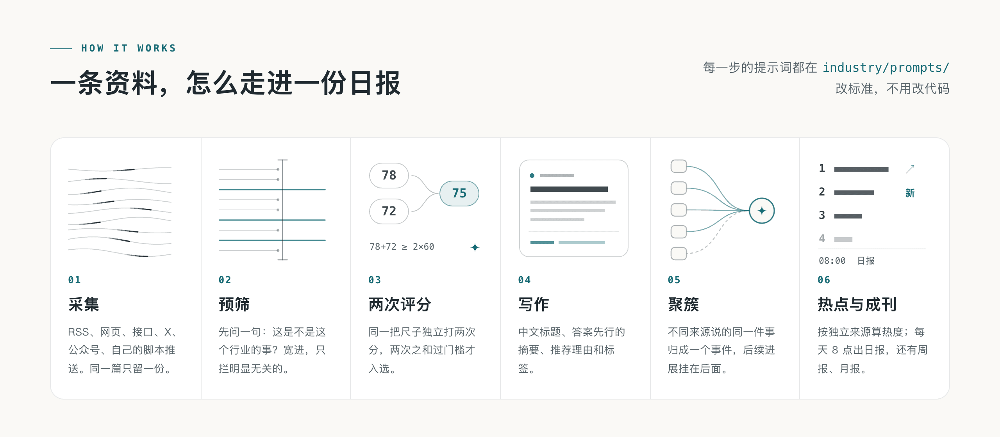
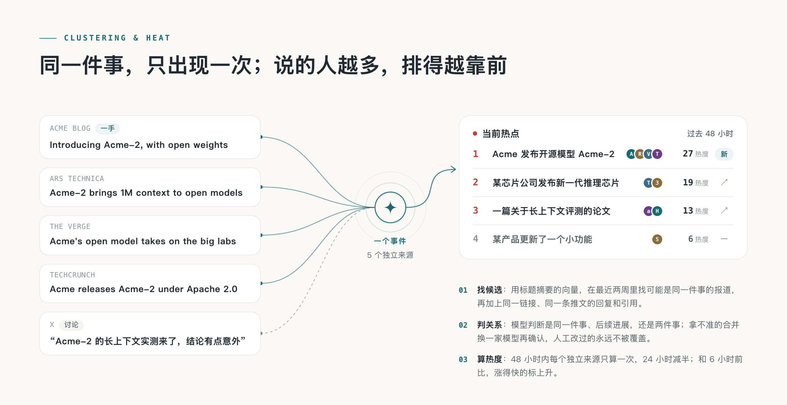
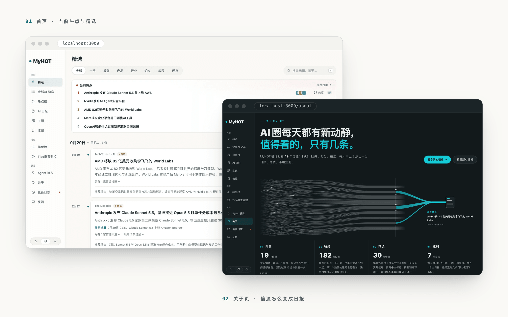

<p align="center">
  <picture>
    <source media="(prefers-color-scheme: dark)" srcset="docs/assets/banner-dark.png">
    
  </picture>
</p>

<p align="center">
  <a href="LICENSE"></a>
  
  
  <a href="https://mrf3247.github.io/medhot/"></a>
</p>

<p align="center">
  <b>一个自己盯全球医学信源、自己写日报的网站。</b><br>
  期刊与预印本、药监与公卫机构、行业媒体、大众健康报道，先筛选再独立评分，选出来的写成中文标题、摘要和推荐理由。
</p>

<p align="center">
  <a href="#跑起来">跑起来</a> ·
  <a href="#信源59-个">信源</a> ·
  <a href="#它是怎么工作的">它是怎么工作的</a> ·
  <a href="#大事榜hot按值得看排不按讨论人数">大事榜</a> ·
  <a href="#发布到公网">发布到公网</a> ·
  <a href="MedHOT-本地运行说明.md">本地运行说明</a>
</p>

<br>

## 这是什么

MedHOT 是 [AIHOT](https://github.com/KKKKhazix/AIHOT)（MIT）开源框架的**医学版**。同一套流水线：

> 采集 → 机械判重 → 模型预筛 → **同一份标准独立打两次分** → 过门槛进精选 → 写中文标题 / 摘要 / 推荐理由 / 标签 → 把不同来源说的同一件事聚成一个事件 → 排榜 → 每天早上 08:00 出日报

信源、分类、评分标准（提示词原文）和入选门槛全部换成了医学口径，并且都在这个仓库里，改标准不用改代码。

- 线上读的是静态快照：<https://mrf3247.github.io/medhot/>
- 本地跑起来是：<http://localhost:3000>　后台 `/admin`

## 为什么不能把 AI 版直接当医学站用

三处是实测出来的**结构性差异**，不是调参能解决的：

| | AI 行业的样子 | 医学（实测） | MedHOT 的处理 |
|---|---|---|---|
| 同一件事有多少家在说 | 常态是多源转发 | 767 个事件里只有 24 个曾有两家独立来源，绝大多数是独家 | 上游「≥2 家独立来源 + 48 小时窗」的热榜门槛在医学上等于**长期空榜**（不是故障），改成按重要度排的**大事榜**（`importance-v1-maxscore`），窗口 168 小时 |
| 论文从哪抓 | X、博客、媒体 | Nature / NEJM / Lancet 的页面抓不住（付费墙 + 反爬） | 29 个期刊源走 **Europe PMC 官方接口**（按 ISSN 查、只收有摘要的、按最早发表日期倒序），一次拿到 DOI + 摘要，不碰出版社页面 |
| 预印本 | 数量正常 | medRxiv / bioRxiv 量大、精选率 0 | 单列 `/preprints` 分区，不进「全部动态」混排，页面明确标注未经同行评议 |

## 说在前面

- **这是一个行业版的改造，不是通用框架。** 改造面主要在 `industry/` 一个文件夹，但也动了四处前端文案、导航和 `packages/contracts`，另外为「本机没有 Docker」这套环境做了两处本地补丁（换 Docker 官方镜像后都不需要）。全部差异见[本地运行说明](MedHOT-本地运行说明.md)。
- **门槛还没按医学校准。** `industry/selection.ts` 里那组数（T1 60 / T1_5 65 / T2 76）仍是 AIHOT 在 AI 领域校准的结果，医学版只是沿用。这是这个仓库**最需要继续改的地方**，校准方法写在 [精选与校准](docs/selection.md)。
- **信源是公开可抓的。** 59 个源全部实测过；期刊论文走官方接口，不绕付费墙。
- **不要用 AIHOT 的名字和 Logo。** 本项目与 AIHOT 是改造关系，站名、图标、配色都是自己的。

## 它是怎么工作的

<picture>
  <source media="(prefers-color-scheme: dark)" srcset="docs/assets/how-dark.png">
  
</picture>

一条资料从信源进来，先按标题和链接机械判重，再预筛；可能重要的由同一份评分标准**独立打两次分**，两次之和 ≥ 2 × 门槛才进精选；然后写中文标题、答案先行的摘要、推荐理由和标签，外文做全文翻译；不同来源说的同一件事聚成一个事件；最后进日报。每一步的提示词都在 [`industry/prompts/`](industry/prompts/)：

- `prefilter.md` —— 医学相关性预筛，宽召回，只拦明显无关（保健品营销、考试培训广告直接拦掉）
- `selection-score.md` —— **核心**：五轴（实质份量 / 信息增量 / **证据强度** / 共振面 / 可用性）× 8 种内容类型的权重表，外加医学版「必须正常评价」与「必须压住的噪声」清单
- `content-understanding.md` —— 内容类型、医学标签白名单、推荐理由禁用词（神药 / 攻克 / 奇迹）
- `rules-domain.md` —— 医学翻译规则：靶点与统计缩写保留英文；incidence 发病率 ≠ prevalence 患病率；**不允许把 HR 0.72 换算成「风险降低 28%」**；证据等级词不许升级（preprint 就是预印本）
- `rules-self-contained-title.md` —— 标题动作词是硬边界：递交申请 ≠ 获批，trend toward improvement ≠ 有效，in mice ≠ 在患者中
- `story-digest.md` —— 事件综述要写清证据等级的变化链条，必须写安全性

### 聚簇与大事榜

<picture>
  <source media="(prefers-color-scheme: dark)" srcset="docs/assets/cluster-dark.png">
  
</picture>

同一件事，监管机构发一次公告、十家媒体各写一篇，读者只需要看到一次。聚簇先用标题摘要的向量在最近两周里找候选，再让模型判断是同一件事、后续进展，还是两件事；拿不准的合并，换一家模型再确认一遍。医学上这一步额外要分清「同一款药的不同适应症」「原研与仿制」「同一靶点的两家公司」，靠的是 `industry/taxonomy.ts` 里的主体名录和身份词典。

**大事榜**（`/hot`）排序看的不是讨论人数，而是**重要度**：取窗口内每个事件所有公开报道里最高的精选评分，同分按时间新近兜底；热度（多少家来源、多少人在说）降级成卡片上的徽章，只作上下文。窗口 `HOT_WINDOW_HOURS=168`（7 天），因为医学事件更新慢。

> 为什么不是「热度榜」：医学信源绝大多数是独家，按独立来源数排会长期空榜。这条规则跟信源结构不匹配，不是故障。

## 你会得到什么

| | |
|---|---|
| **信源** | 三档分级（T1 官方一手 / T1_5 预印本 / T2 媒体与个人），抓取间隔按产出自动调整。支持 RSS、网页列表、JSON 接口、X 账号、微信公众号，以及外部脚本推送。本项目 59 个源 = 30 个 RSS + 29 个 Europe PMC 的 JSON 接口 |
| **精选** | 预筛 + 同一标准独立打两次分 + 按分级门槛决定入选；提示词和门槛全部在仓库里，可以用自己标注的样本在 SelectBench 里校准 |
| **写作** | 中文标题、答案先行的摘要、推荐理由、标签，外文全文翻译；提示词里写死了医学不许做的事（见上） |
| **聚簇** | 同一件事的报道归成一个事件，事件页有综述；综述必须写清证据等级变化和安全性；人工改过的归属不会被覆盖 |
| **大事榜** | 按事件重要度排（窗口内最高精选评分，7 天窗口），热度作徽章 |
| **日报、周报、月报** | 每天 08:00 出日报，每周一出周报，每月 1 日出月报，按分类分节、带导语 |
| **主题与搜索** | 37 个主题页：机构与公司 14（FDA / EMA / NMPA / WHO / CDC / 顶刊 / 辉瑞 / 默沙东 / 罗氏 / GLP-1 与减重 / 阿斯利康 / Moderna / 美敦力 / 中国创新药）、疾病与方向 11、内容形态 12；另有标题摘要搜索与全文相关搜索 |
| **预印本分区** | `/preprints` 独立成页，不精选、不上大事榜、不进日报；「全部动态」底部只留一行「另有 N 条预印本更新 →」 |
| **给 Agent 用** | RSS（精选 / 全部 / 全文 / 日报）、公开 API、MCP（工具名前缀 `medhot_`）、`llms.txt` |
| **后台** | 信源管理与试抓、内容诊断、精选评测、每一步单独换模型、付费服务的预算熔断、运行记录与告警 |
| **AI 行业专属模块** | 模型榜、Codex 重置监控 —— 本项目两个开关都已关掉（`industry/features.ts`），导航里不再出现入口，相关任务不再运行 |

## 看一眼

<picture>
  <source media="(prefers-color-scheme: dark)" srcset="docs/assets/shots-dark.png">
  
</picture>

## 跑起来

### 本机（当前的部署方式）

本机没有 Docker / Homebrew，是 PostgreSQL 16.2（`/Users/Jin/pgsql/16/bin`）+ Node 26.8.1 直接跑：

```bash
cd /path/to/MedHOT
./medhot.sh start          # 起 postgres + api + worker + web
./medhot.sh status         # 进程 / 已入库 / 精选条数
./medhot.sh logs worker 80 # 看某个进程日志
./medhot.sh stop           # 停三个进程（postgres 保持运行）
```

- 网站 `3000` · API `3001` · PostgreSQL `5433` · 后台 `/admin`
- 后台密码在 `.env` 的 `ADMIN_PASSWORD`。**`.env` 含密钥，不进 Git**
- 环境细节、两处本地补丁、自测命令见 [MedHOT-本地运行说明.md](MedHOT-本地运行说明.md)

### 用 Docker（上游方式）

```bash
git clone https://github.com/MRF3247/medhot.git medhot
cd medhot
node scripts/init-env.ts --llm-key <你的模型 API Key>   # DeepSeek、千问、智谱等 OpenAI 兼容接口都行
docker compose up -d --build
```

打开 <http://localhost:3000>。一两分钟后开始有内容，第一次导入的资料大约半小时处理完。

## 信源（59 个）

| 组 | 数量 | 怎么抓 | 分级 |
|---|---|---|---|
| 期刊官网（RSS） | 12 | RSS | T1 | 
| 期刊论文 | 29 | Europe PMC 官方接口，按 ISSN 查、只收有摘要的、**按最早发表日期倒序** | T1 |
| 预印本 | 2 | medRxiv / bioRxiv | T1_5 |
| 监管与公共卫生 | 3 | FDA 新闻稿 / CDC 新闻 / WHO 新闻 | T1 |
| 行业媒体 | 6 | STAT News、Endpoints News、BioPharma Dive、Healthcare Dive、MedCity News、Health Affairs | T2 |
| 临床媒体 | 2 | MedPage Today、Medscape | T2 |
| 大众健康 | 5 | BBC / NPR / NYT / Guardian 健康版、ScienceDaily | T2 |

期刊官网 12 家：Nature、Nature Medicine、Nature Biotechnology、Nature Reviews Cancer、NEJM、NEJM Evidence、The Lancet、The Lancet Oncology、The Lancet Infectious Diseases、JAMA、Cell、Science。

Europe PMC 那 29 家含 The BMJ、Annals of Internal Medicine、JAMA 系列、PLOS Medicine、Circulation、European Heart Journal、JACC、Gut、Gastroenterology、JCO、Blood、Diabetes Care、Lancet 子刊、Clinical Infectious Diseases、Intensive Care Medicine、Radiology、Pediatrics、Brain、European Urology、Cancer Cell、Cell Research、STTT、Chinese Medical Journal、Journal of Hepatology、Lancet Global Health、Nature Reviews Clinical Oncology 等。

**加医学期刊源的做法**（不要抓出版社页面）：

```
URL:    https://www.ebi.ac.uk/europepmc/webservices/rest/search?query=ISSN:<刊号>%20AND%20SRC:MED%20AND%20HAS_ABSTRACT:Y&format=json&pageSize=25&sort=FIRST_PDATE_D%20desc&resultType=core
类型:   json_list
要点:   ① 必须 HAS_ABSTRACT:Y（否则来函、勘误、社论都进来）
        ② 排序必须按 FIRST_PDATE_D（最早发表日期），用印刷日期会一直看到旧文
        ③ 用 ISSN 查，不要用刊名查
        ④ 摘要有 HTML 实体，标题里可能留 m<sup>6</sup>A 之类，别拿原始标题当成品
```

**中文信源怎么办**：国内医学媒体基本只发公众号，实测医脉通 / 健康界 / 生物谷 / 梅斯 / 澎湃健康都没有可用 RSS。两条路：① 后台建 `mp_account` 信源（需要「极致了」的 key，按次计费、有预算熔断）；② 用 `external` 推送接口，把已有的抓取脚本结果 POST 进来（配 `INGEST_TOKEN`）——B站 / 小红书 / 抖音 / 视频号那部分最适合走这条路。

## 大事榜（`/hot`）：按「值得看」排，不按讨论人数

- 排序键：窗口内每个事件所有公开报道里**最高的精选评分**（`publications.score`），同分按时间新近兜底
- 规则版本：`HOT_RULE_VERSION = "importance-v1-maxscore"`（`packages/backend/src/events/hot.ts`）
- 窗口：`HOT_WINDOW_HOURS`，本项目设 **168**（7 天）；不设默认 48 小时
- 立刻重算：`node --env-file=.env scripts/hot-now.ts`（不用等 worker 的 5 分钟一批）
- 取分必须走 facts / fact_articles 关联，**不能只看 `publications.story_id`**：未落组或重分组滞后的行 `story_id` 为空，只按它筛会漏掉大半事件
- 前端：「热点榜」已全部改叫「大事榜」（导航、`/more`、事件页、Agent 页、`llms.ts`）

## 发布到公网

**静态快照 + 定时推 GitHub Pages**（当前方案，免费、不需要域名）：

```bash
./snapshot.sh          # 抓本机站点的只读快照 → 强推 gh-pages 分支
```

- 地址固定：<https://mrf3247.github.io/medhot/>　·　launchd 任务 `com.medhot.snapshot` 每天 9:00 / 12:00 / 15:00 自动跑
- 快照范围：首页 / 大事榜 / 全部动态 / 日报（最近几期）/ 主题 / 预印本 / Agent / 关于 / 更新日志 + 事件页
- 改了前端不用手动构建，快照脚本发现 build 不存在会自己重建
- 代价：**不是实时**，内容跟着快照时间走；本机开机时才会推

> 曾经用过 Cloudflare 快速隧道（`publish.sh`）做实时站点，实测不可用：地址每次重启都换、本机到 Cloudflare 边缘的链路常常不通，旧地址会永久失效。**不要把它当长期链接发出去。**

## 文档

| 文档 | 内容 |
|---|---|
| [本地运行说明](MedHOT-本地运行说明.md) | **本项目实际怎么跑**：启停、端口、运行环境与补丁、相对 AIHOT 改了什么、信源清单、自测、已知限制 |
| [把它改成你的行业](docs/customize.md) | 站名、分类、信源、提示词、门槛、品牌，一步一步来（上游文档，仍然适用） |
| [信源](docs/sources.md) | 六种信源怎么配，分级与全文，外部推送接口 |
| [精选与校准](docs/selection.md) | 一条资料怎么变成精选，怎么用自己的样本校准 |
| [部署](docs/deploy.md) | Docker、域名与 HTTPS、中国大陆、更新、备份、花多少钱 |
| [架构](docs/architecture.md) | 三个进程、几条不变的规则、目录、对外出口 |

技术栈：Node.js · TypeScript · React Router（服务端渲染）· Fastify · PostgreSQL · pg-boss · Tailwind CSS · Docker Compose（可选）。

## 已知限制与下一步

1. **门槛没按医学校准**（最该做的）。现在沿用 AIHOT 的 AI 领域数值；做法是挑 100–200 条稿件人工标「该选 / 不该选」，跑 `scripts/eval-selection.ts`，先改 `prompts/selection-score.md` 的标准，再动门槛。
2. **中文信源未接**（见「信源」一节的两种做法）。
3. **事件归组只有词面与规则线索**，没配向量模型（`EMBEDDING_*` / `DASHSCOPE_API_KEY`），同一件事的跨语言报道可能归不到一起。
4. **首次导入的存量条目按原文时间归档**，不进当天，所以首页只显示最近两天的精选——这是框架「旧文不刷屏」的规则，不是故障。
5. **本地跑的是开发模式**网页（`react-router dev`）；要长期当服务用可以改成 build + `node apps/web/server.ts`（快照脚本已经是这么做的）。

## 许可

代码使用 [MIT 许可证](LICENSE)，源自 [AIHOT](https://github.com/KKKKhazix/AIHOT)（MIT）。AIHOT 的名字和 Logo 不在本项目许可范围内。

---

<sub>**In English:** MedHOT is a medical-news vertical built on the open-source AIHOT framework (MIT). It collects from 59 sources — journal sites, Europe PMC (DOI + abstract, no publisher scraping), preprint servers, regulators and public-health agencies, trade and consumer health media — deduplicates, pre-filters, scores every item twice with the same rubric, keeps those above a source-tiered threshold, writes Chinese headlines and summaries, clusters reports of the same story into one event, ranks a "big news" board by the highest selection score of the event rather than by how many sources discuss it (medical sources are mostly exclusive), and publishes a daily briefing at 08:00 Beijing time. All prompts and thresholds live in `industry/`. The documentation is in Chinese.</sub>
